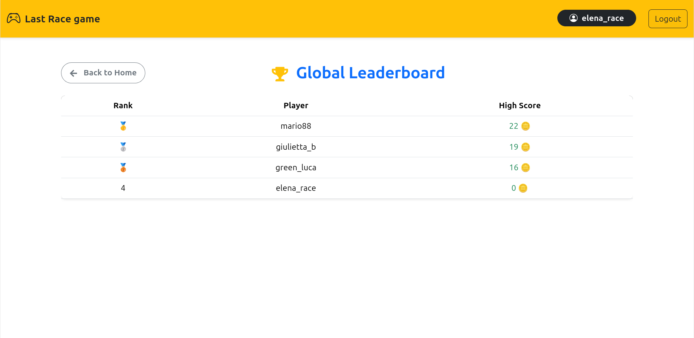
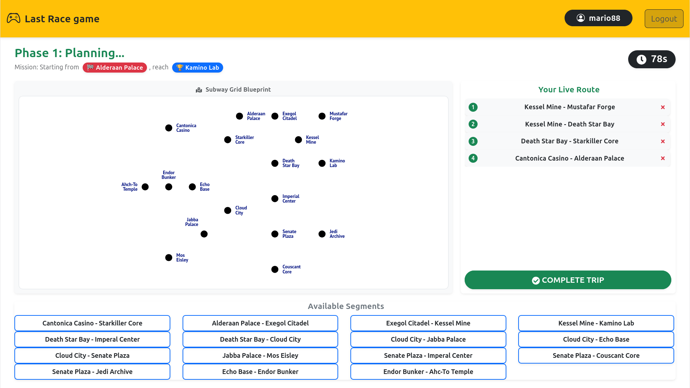

# Exam #1: "Last Race"

## Student: s359291 Bottino Claudio

## React Client Application Routes

- Route `/`: landing page with rules, if the user is logged in button rank and play are displayed
- Route /rank: Leaderboard showing the game records. It only displays the top 20 unique users (no duplicate users allowed).
- Route /play: Core game page divided into 4 sequential stages: Setup, Planning, Execution (Route), and Ending. Each stage is displayed one at a time.

## API Server

User api:

- POST `/api/sessions`
  - in body send password and email
  - response with user information(username, id, mail ...), or error messagge `401` if the credential aren't correct
- GET `/api/sessions`
  - no body
  - response with user information of the current session if present
- DELETE `/api/sessions`
  - no body, delete the current session if present

Game api:

- POST `/api/game/start`
  - no body needed but the user must be logged in
  - response with gameId inserted in db, start and finish station id
  - error 500, internal server error
- POST `/api/game/end`
  - body contains the gameId to validate, and an array with segment of the own route, each segment has 2 id of the stations
  - response with a specific error(e.g. Empty route) or if the route is valide with totCoins collected in that game and an array with segment ordered and event encountered
  - error 500, internal server error(eg DB connection)

  ``` json
    "0": {
      "step": 1,
      "from_station": "11",
      "to_station": "7",
      "event_id": 1,
      "event_description": "Quiet journey",
      "coin_effect": 0,
      "updated_coins": 20
    } 
    ```

- GET `/api/stations`
  - the response is a list of the station present in the db, each entry is (id, name)
- GET `/api/segments`
  - response with a list of segment present in db, only id of the station are returned
- GET `/api/rank`
  - response with ordered array with id, username and max coins correlated to each user.


## Database Tables

- Table `station` - id, name
- Table `connection` - line, station1, station2
- Table `events` - id, name, coins
- Table `users` - id, name, surname, mail, hash, salt

## Main React Components

- `Header` (in `Headr.jsx`):
  Displayed on all pages. It contains the game title (which redirects to the home page) and an authentication button: either a Login button if no session exists, or a Logout button if the user is logged in. If the player is in the game it ask a confirmation.

- `LoginButton`/`LogoutButton` (in `Auth.jsx`):
  UI components rendered inside the Header to handle session states.

- `LoginForm`/`LogoutButton` (in `Auth.jsx`):
  Contains the form displayed on the /login route, featuring two input fields (email and password) and a submit button.

- `Rules` (in `RulesLayout.jsx`):
  Displays a quick introduction to the game. If the user is logged in, it also shows the global Rank and a Play button to navigate to the game.

- `Rank` (in `Rank.jsx`):
  A simple leaderboard component displaying the rank number, username, and total score for each player.

- `GameContainer` (in `phases/GameContainer.jsx`):
  A wrapper component that manages the core game loop across 4 distinct phases, each handled by its own component. It initializes and controls the `currentPhase` state to determine which phase to render.

- `SetupPhase` (in `phases/SetupPhase.jsx`):
  The initial stage. It displays the Start Game button alongside a map of the subway network showing all active transit lines.

- `PlanningPhase` (in `phases/PlanningPhase.jsx`):
  The strategy stage. The user selects segments from a list to submit their route. It displays a countdown timer and a clean map of the subway network without any pre-drawn lines.

- `ExecutionPhase` (in `phases/ExecutionPhase.jsx`):
  It processes the submitted route and renders each step interactively along with its associated random event. Once all steps have been displayed, the user can proceed. If the submitted route is invalid, this phase is skipped entirely.

- `EndingPhase` (in `phases/EndingPhase.jsx`):
  The game-over stage. It acts as a recap of the match just played (showing total coins collected or route validation errors). From here, the user can choose to either return to the home page or start a new match.

- `NotFound` (in `NotFound.jsx`):
  The fallback error page for any invalid or unmapped 404 routes.

## Screenshot




## Users Credentials

| id  | name   | surname | email                    | username     | password    |
| --- | ------ | ------- | ------------------------ | ------------ | ----------- |
| 1   | Mario  | Rosasi  | mario\.rossi@test\.com   | mario88      | password123 |
| 2   | Giulia | Bianchi | giulia\.bianchi@test\.it | giulietta\_b | secret2026  |
| 3   | Luca   | Verdi   | l\.verdi@test\.com       | green\_luca  | metro_fan   |
| 4   | Elena  | Ferrari | e\.ferrari@lastrace\.net | elena\_race  | speedy99    |

## Use of AI Tools

I use AI(gemini) to validate my backend logic, invent station names.
In the client part I use it to create className attribute to div components to have a more pleasant result. All generated code has been checked and adapted.
